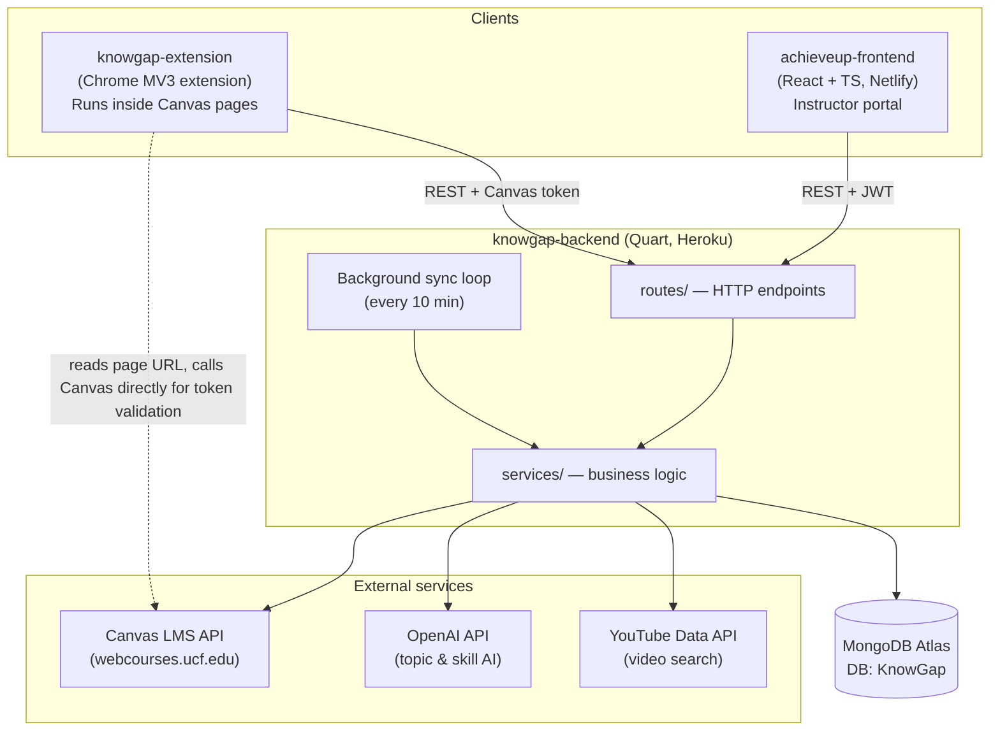
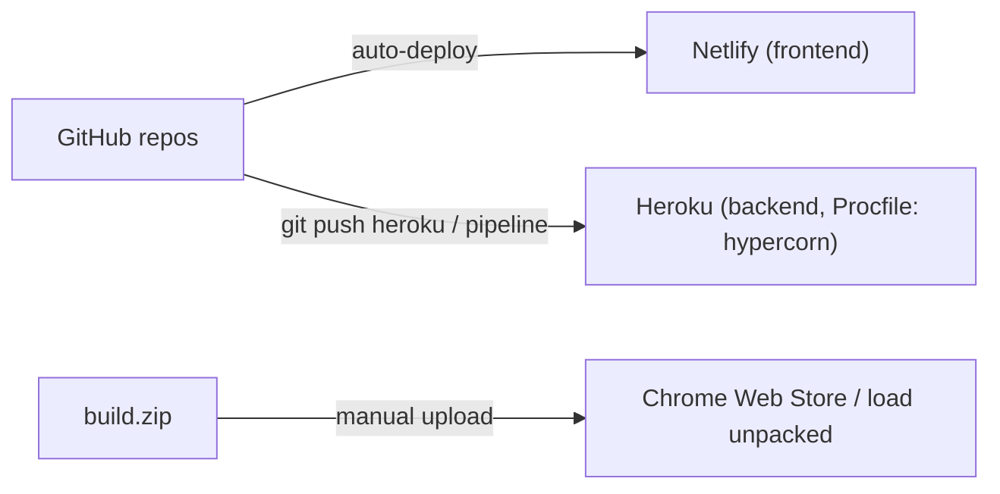

# System Architecture

Three repos, one backend, two user-facing clients. Everything ultimately revolves around **Canvas quiz data** stored in **MongoDB**.

## How the pieces map to repos

| Repo | What it is | Talks to | Details |
|---|---|---|---|
| `achieveup-frontend` | React SPA for **instructors** (AchieveUp) | Backend only | [[Frontend Overview]] |
| `knowgap-backend` | Quart async API — **single source of truth** | MongoDB, Canvas, OpenAI, YouTube | [[Backend Overview]] |
| `knowgap-extension` | Chrome extension for **students & instructors inside Canvas** (KnowGap) | Backend + Canvas directly | [[Extension Overview]] |

## Two route "generations" in the backend
This is the most important structural fact to understand early:

1. **Legacy KnowGap routes** — registered with `init_*_routes(app)` functions, flat endpoints like `/get-course-videos`, `/get-student-grade`, `/add-token`. Used by the **extension**.
2. **AchieveUp blueprints** — Quart Blueprints (`auth_bp`, `skill_bp`, `badge_bp`, …) with prefixed endpoints like `/achieveup/matrix/create`, `/auth/login`. Used by the **web frontend**.

Both generations live in `app.py` side by side. See [[Backend File Guide]].

## Authentication differs per client
- **Frontend → backend:** email/password signup, [[JWT Authentication|JWT]] in `Authorization: Bearer`, Canvas API token stored encrypted server-side. See [[Flow - Authentication]].
- **Extension → backend:** sends the user's **Canvas API token** with requests (older cookie/token model, no JWT account).

## Data backbone
MongoDB collections are defined centrally in `config.py` — see [[Database Collections]]. The [[Flow - Background Canvas Sync|sync loop]] keeps quiz/submission data fresh; everything else (mastery, risk, analytics, badges) is computed from it.

## Deployment

