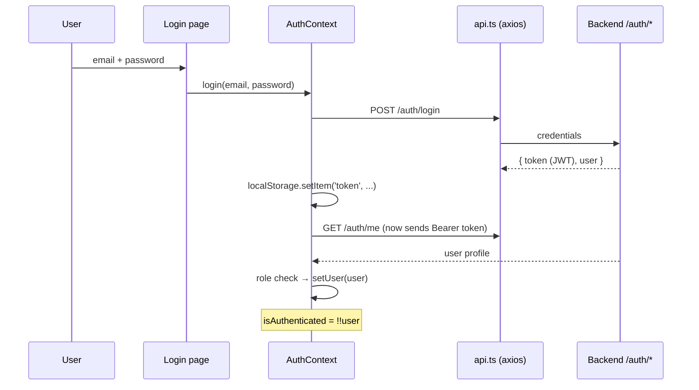

# Frontend Auth Flow

How login state works in the web app. Files involved: `contexts/AuthContext.tsx`, `services/api.ts`, `App.tsx` (`ProtectedRoute`), `pages/Login.tsx`, `pages/Signup.tsx`.

## Key behaviors (from reading `AuthContext.tsx`)
- **Persistence:** the JWT lives in `localStorage` under key `token`. On every app load, `checkAuthStatus()` runs in a `useEffect` — if a token exists it calls `/auth/me` to validate it and rebuild the `user` object. Invalid token → removed, user logged out.
- **Instructor-only gate (client-side):** after login/verify, the context checks `role === 'instructor' || 'admin'`, **or** `canvasTokenType === 'instructor'`, **or** the user has *no* Canvas token at all (deliberately permissive so people can sign up before adding a token). Non-instructors are force-logged-out.
- **Signup forces the role:** `signup()` overrides whatever was passed with `role: 'instructor'`, `canvasTokenType: 'instructor'`.
- **Resilience quirks:** if `/auth/me` fails right after login/signup but a token was returned, the context *still treats you as logged in* with a synthesized user object. It also tracks `backendAvailable` to distinguish "wrong password" from "backend down."
- **Route protection:** `ProtectedRoute` in `App.tsx` reads `isAuthenticated`/`loading` from `useAuth()`; shows a spinner while loading, redirects to `/login` if not authenticated.
- **Auto-logout:** the axios response interceptor (see [[Frontend API Layer]]) clears the token and redirects on any 401.

## Server side
The backend half (password hashing, JWT issuance, Canvas token encryption) is in `routes/auth_routes.py` + `services/achieveup_auth_service.py` — see [[Flow - Authentication]] for the full picture and [[JWT Authentication]] for the concept.

> [!warning] Security note worth discussing as a team
> JWT in `localStorage` is vulnerable to XSS token theft (vs. httpOnly cookies). Also note the client-side role check is cosmetic — real enforcement must happen in the backend routes.
