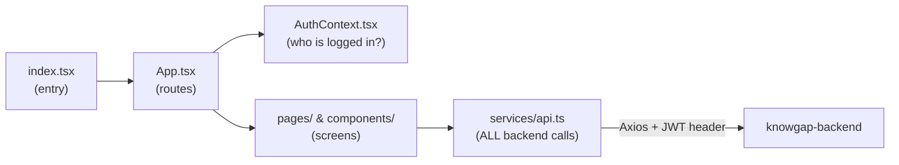

# Frontend Overview — `achieveup-frontend`

The **AchieveUp instructor portal**: a single-page React app where instructors create skill matrices, map quiz questions to skills, and monitor student mastery, risk, and badges.

- **Stack:** React 18 + TypeScript, [[Tailwind CSS]] (UCF gold theme), React Router, Axios, react-hot-toast, react-hook-form, lucide-react icons.
- **Created with:** Create React App (`react-scripts`) — so there's no visible webpack config; `npm start` runs a dev server on port 3000.
- **Deploys:** Netlify (`netlify.toml`), production at achieveup.netlify.app.
- **Backend URL:** `REACT_APP_API_URL` env var, defaults to `http://localhost:5001`.

## Mental model (read this before the code)

## How it all works together (the story)

1. **The browser loads an almost-empty page.** `public/index.html` has basically just `
` in it. There's no real HTML anywhere — everything you see is built by JavaScript.
2. **`index.tsx` is the ignition.** It runs once, grabs that empty div, and renders `<App />` into it. That's its entire job.
3. **`App.tsx` sets up the environment, then picks a screen.** It wraps everything in two layers: `AuthProvider` (so every component below can ask "who's logged in?") and `Router` (so the URL controls what renders). Its `<Routes>` block is essentially a switch statement on the URL: `/dashboard` → Dashboard, `/skill-matrix` → SkillMatrixCreator, and so on.
4. **Meanwhile, `AuthContext.tsx` figures out who you are.** On load it checks `localStorage` for a saved JWT and calls `/auth/me` to validate it. While it's checking, `loading` is true — that's the spinner on refresh. `ProtectedRoute` (in App.tsx) watches this: spinner while loading, redirect to `/login` if there's no valid user, otherwise let the page through. Details: [[Frontend Auth Flow]].
5. **Every protected screen renders inside `Layout`.** Layout = the constant shell (the `Navigation` top bar) with a hole in the middle. Clicking a nav link doesn't reload anything — Router just swaps which page component fills the hole.
6. **Each page fetches its own data through `api.ts`.** Identical pattern everywhere: page mounts → `useEffect` fires → calls e.g. `instructorAPI.getCourseStudentAnalytics()` → axios silently attaches your JWT → backend responds → `setState(data)` → React re-renders with real content. While the round-trip runs, the page's own `loading` state shows a spinner. Details: [[Frontend API Layer]].
7. **The small stuff:** `common/Button`, `Input`, `Card` are reusable Lego bricks the pages assemble; `types/index.ts` defines the shapes of the data flying around; [[Tailwind CSS]] classes handle all styling inline.

So the chain for visiting `/progress` is: URL changes → Router matches → ProtectedRoute confirms you're logged in → Layout renders nav → StudentProgress mounts → `useEffect` → `api.ts` → backend → table appears.

Three structural rules that make this codebase easy to navigate:
1. **Every backend call goes through `src/services/api.ts`** — grouped into exported objects (`authAPI`, `skillMatrixAPI`, `badgeAPI`, `instructorAPI`, …). If you wonder "how does screen X get its data," find the API group it imports. See [[Frontend API Layer]].
2. **Auth state lives in one place** — `src/contexts/AuthContext.tsx`, a React Context wrapping the whole app. See [[Frontend Auth Flow]] and [[React Concepts#Context]].
3. **Routes = screens** — `App.tsx` declares every URL. Each route is wrapped in `ProtectedRoute` (redirects to `/login` if unauthenticated) and `Layout` (nav bar shell).

## The screens (routes in `App.tsx`)
| Route | Component | What the instructor does there |
|---|---|---|
| `/login`, `/signup` | `pages/Login`, `pages/Signup` | Email/password auth; optional Canvas token at signup |
| `/dashboard` | `pages/Dashboard` | Course list, workflow progress, recent activity |
| `/skill-matrix` | `components/SkillMatrixCreator` | Step 1: define course skills (AI suggestions available) |
| `/skill-assignment` | `components/SkillAssignmentInterface` | Step 2: map quiz questions → skills (AI bulk-assign) |
| `/progress` | `StudentProgress` (defined *inline in App.tsx*) | Step 3: per-student mastery table, risk levels, Sync Now button |
| `/settings` | `pages/Settings` | Canvas token management, profile |
| `/badges/:studentId` | `pages/StudentPublicBadges` | **Public** (no login) shareable badge page |
| `/badges-test` | `components/StudentBadgesTest` | Dev/test harness for badge display |

⚠️ Quirk: `StudentProgress` (~600 lines) is defined inside `App.tsx` rather than its own file — likely a candidate for refactoring.

## Where to go next
- [[App.tsx Walkthrough]] — section-by-section reading companion for `App.tsx`
- [[Frontend File Guide]] — every file explained
- [[Flow - Instructor Skill Workflow]] — the workflow these screens implement
- [[React Concepts]] — the React features this app uses, with examples from this code
