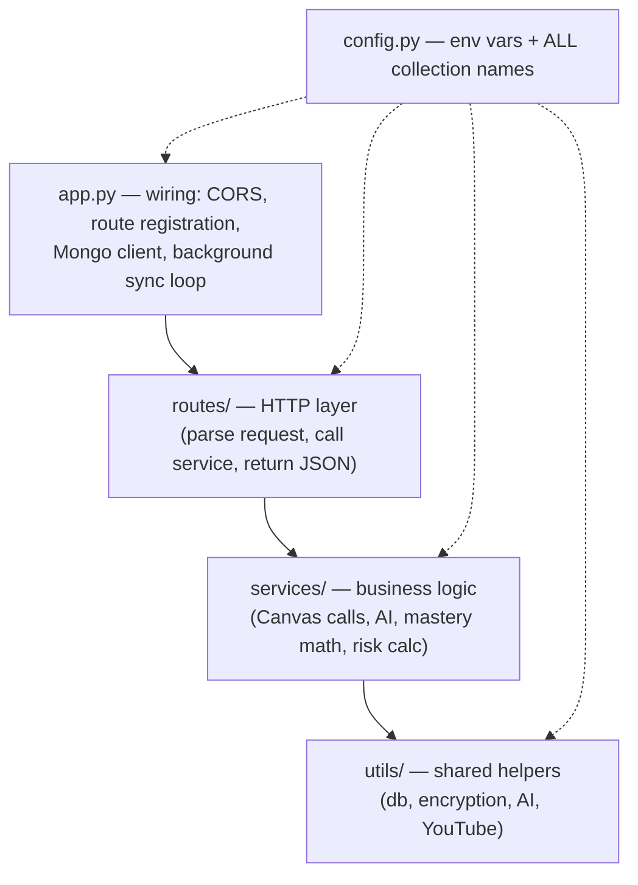

# Backend Overview — `knowgap-backend`

The shared brain of both products. A **Python async API** built with [[Quart and Async Python|Quart]] (async Flask clone), storing everything in [[MongoDB Notes|MongoDB]] via Motor (async driver), deployed on Heroku (`Procfile`).

> [!warning] README inconsistency
> The frontend README claims the backend is "Node.js + Express" — it is **not**. It's Python/Quart. Trust the code. (Tracked in [[Open Questions]].)

## Layered structure


**Rule of thumb:** routes should be thin, services do the work. (Not always followed — `routes/achieveup_routes.py` is 1,887 lines.)

## The two generations of code (critical to understand)
| | Legacy **KnowGap** | Newer **AchieveUp** |
|---|---|---|
| Registration style | `init_base_routes(app)` … functions | Quart **Blueprints** (`auth_bp`, `skill_bp`, …) |
| Endpoint style | flat: `/get-course-videos`, `/add-token` | prefixed: `/achieveup/...`, `/auth/...`, `/canvas/...` |
| Client | Chrome [[Extension Overview|extension]] | React [[Frontend Overview|web app]] |
| Auth | Canvas token passed in request / `Tokens` collection | [[JWT Authentication|JWT]] accounts (`AchieveUp_Users`) |
| Routes files | `base/user/video/support/course_routes.py` | `auth/canvas/skill/badge/progress/analytics/achieveup/instructor_routes.py` |

## What `app.py` does (read it first — 239 lines)
1. **CORS** — allows the extension, Canvas domains, localhost, and the Netlify frontend.
2. **Registers all routes** (both generations).
3. **Connects to MongoDB Atlas** (`Config.DB_CONNECTION_STRING`), creates indexes.
4. **Starts the background sync loop** (`schedule_updates`) on startup — every `SET_TIMER = 600`s it refreshes quiz data, videos, and mastery for every known course. Full detail: [[Flow - Background Canvas Sync]].

## External integrations
- **Canvas LMS** — quiz/course/submission data, via per-user tokens. `services/achieveup_canvas_service.py`, `services/canvas_submissions_service.py`. See [[Canvas LMS API]].
- **OpenAI** — core-topic extraction (videos) + skill suggestion / question classification. `utils/ai_utils.py`, `services/achieveup_ai_service.py`. See [[OpenAI Integration]].
- **YouTube Data API** — video search by topic. `utils/youtube_utils.py`.
- **Encryption** — Canvas tokens encrypted at rest with Fernet (`utils/encryption_utils.py`), key from `HEX_ENCRYPTION_KEY` env var.

## Running locally
```bash
cd knowgap-backend
python3 -m venv venv && source venv/bin/activate
pip install -r requirements.txt
cp demo.env .env   # then fill in real values
python app.py      # runs on http://localhost:5001
```
Required env vars (checked at startup in `config.py`): `DB_CONNECTION_STRING`, `HEX_ENCRYPTION_KEY`, `OPENAI_KEY`, `YOUTUBE_API_KEY`. `ENVIRONMENT=development` switches the DB to `KnowGap_Dev` and relaxes TLS checks.

## Where to go next
- [[Backend File Guide]] — every file
- [[API Route Reference]] — every endpoint, grouped
- [[Database Collections]] — the data model
- [[Flow - Background Canvas Sync]] — the engine that keeps data fresh
