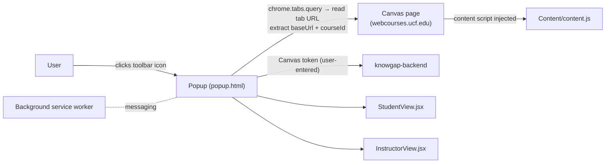

# Extension Overview — `knowgap-extension`

The **KnowGap Chrome extension** ("KnowGap for Canvas"): students and instructors open it while on a Canvas page; it detects the course from the URL and shows video recommendations, grades/risk, and support resources.

- **Stack:** React (JSX, *not* TypeScript for the main views), Chrome **Manifest V3**, built with **webpack** (custom config — this is a fork of the popular `chrome-extension-boilerplate-react`).
- **Backend:** same `knowgap-backend`, via `BACKEND_URL` env var baked in at build time (`utils/env.js` / webpack DefinePlugin).

> [!warning] Two manifests — don't get confused
> - **Repo-root files** (`manifest.json`, `index.html`, `popup.js`, `popup.css`) are a tiny *standalone demo* ("GenAIprime Extension") that just searches YouTube with a user-supplied API key. It is **not** the real product.
> - **The real extension** is `src/manifest.json` ("KnowGap for Canvas", v1.3.8), built by webpack into `build/` (the `build.zip` files are packaged releases).

## How it works


1. **Popup opens** (`src/pages/Popup/Popup.jsx`): reads the active tab's URL, regex-extracts the Canvas `baseUrl` and `/courses/<id>` course ID.
2. **Token setup:** user pastes their Canvas API token; popup validates it by calling Canvas's `/api/v1/users/self` directly, then registers it with the backend (`/add-token`) so the [[Flow - Background Canvas Sync|sync loop]] can keep the course updated.
3. **Role split:** based on the user's Canvas role, renders **StudentView** (video recs for missed questions, support videos — see [[Flow - Student Video Recommendations]]) or **InstructorView** (per-student risk levels, video curation — see [[Flow - Risk Prediction]]).

## MV3 pieces used (see [[Chrome Extension Concepts]])
| Piece | File | Role here |
|---|---|---|
| Popup | `src/pages/Popup/` | The whole UI, ~3,000 lines across 3 components |
| Content script | `src/pages/Content/` | Injected into Canvas pages (matches `canvas.instructure.com` + `webcourses.ucf.edu`); styles + page hooks; exposes `sidebar.html` |
| Background service worker | `src/pages/Background/` | Long-lived logic/messaging |
| Options page | `src/pages/Options/` | Extension settings |
| Newtab / Panel / Devtools | `src/pages/...` | **Boilerplate leftovers** from the template — mostly unused |

## Build & load
```bash
cd knowgap-extension
npm install
npm run build       # outputs build/
# Chrome → chrome://extensions → Developer mode → Load unpacked → select build/
```
Dev mode (`npm start`) runs `utils/webserver.js` with hot reload.

Next: [[Extension File Guide]]
