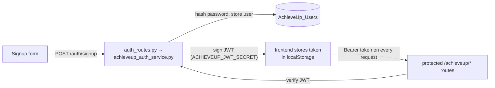

# Flow: Authentication (end to end)

There are **two separate identity systems**. Don't conflate them.

## 1. AchieveUp accounts (web app) — JWT

- Password auth + [[JWT Authentication|JWT]]; secret = `ACHIEVEUP_JWT_SECRET` env var (⚠️ has a hardcoded default fallback in `config.py` — must be set in prod).
- The user's **Canvas API token** is optional at signup, can be added in Settings; it's validated against Canvas (`POST /auth/validate-canvas-token`) and stored **Fernet-encrypted** in the user document.
- Frontend half documented in [[Frontend Auth Flow]].

## 2. Canvas tokens (extension) — no account at all
- The extension user pastes their **Canvas personal access token** into the popup.
- Popup validates it by calling Canvas directly (`GET <canvas>/api/v1/users/self`).
- Token is registered with the backend via `POST /add-token` → encrypted into the legacy `Tokens` collection along with course IDs, which enrolls the user in the [[Flow - Background Canvas Sync|sync loop]].
- Subsequent extension requests pass the token (or identify the user) per call — there is no JWT/session.

## Canvas-token trust model (both systems)
The backend acts **as the user** against Canvas using their token. Tokens are powerful (full account access), hence:
- Encrypted at rest (Fernet, `HEX_ENCRYPTION_KEY`)
- Token *type* detection distinguishes instructor vs student tokens (`achieveup_canvas_service.py`)
- The TODO lists from the previous team repeatedly mention migrating to **OAuth2** — the proper long-term fix.

Related: [[JWT Authentication]] · [[Canvas LMS API]] · [[Frontend Auth Flow]]
