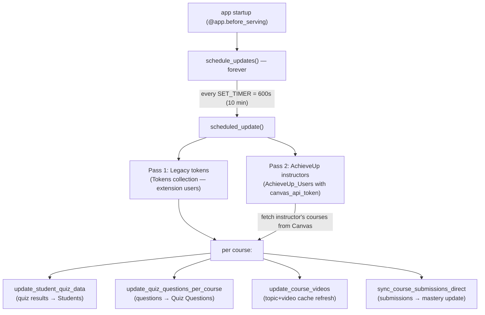

# Flow: Background Canvas Sync

The engine room. A loop in `app.py` keeps MongoDB in sync with Canvas so every feature (videos, risk, mastery, analytics) has data to work with.

## Details that matter
- **Started by:** `@app.before_serving startup()` → `asyncio.create_task(schedule_updates())`. It's an `asyncio` task inside the web process — *not* a separate worker dyno. If the dyno sleeps/restarts, the loop restarts with it.
- **Decryption:** each stored Canvas token is Fernet-decrypted (`utils/encryption_utils.py`) before use.
- **Rate limiting:** `await asyncio.sleep(1)` between courses, `sleep(2)` between users — crude protection against Canvas API limits (`CANVAS_API_RATE_LIMIT` config exists too).
- **Two user populations:**
  1. **Legacy `Tokens` docs** store `course_ids` directly + the Canvas host in `link`.
  2. **AchieveUp instructors** don't store course IDs — the loop calls `get_instructor_courses()` live, defaulting host to `canvas.instructure.com` (⚠️ note: *not* webcourses.ucf.edu — see [[Open Questions]]).
- **Errors are swallowed** per-course/per-user with logging, so one bad token can't kill the loop.

## Manual trigger ("Sync Now")
`POST /achieveup/instructor/course/<id>/force-sync` runs the same pipeline for one course on demand. The frontend Progress page treats HTTP 202 as "still running" and polls results every 15s for a minute.

## Why you should care
Almost every "why is the data stale/empty?" bug traces back here. Debug checklist:
1. Is there a token for the user in `Tokens` / `AchieveUp_Users`?
2. Did the loop log errors for that course (Heroku logs)?
3. Did force-sync work? If yes, the loop's token/course discovery is the problem.

Files: `app.py` (loop) · `services/course_service.py` · `services/video_service.py` · `services/canvas_submissions_service.py` · `services/mastery_service.py`
