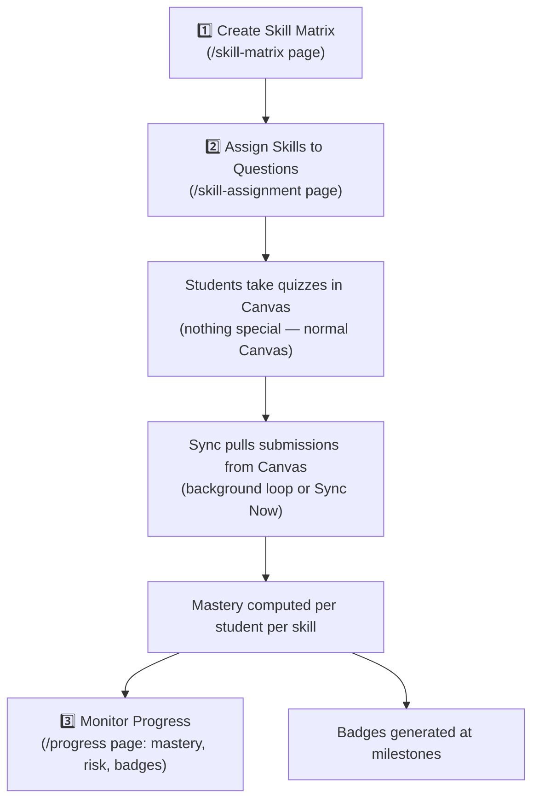

# Flow: Instructor Skill Workflow (AchieveUp's core loop)

This is **the** workflow the web app exists for. Three setup steps by the instructor, then the system tracks students automatically.

## Step 1 — Create a skill matrix
- UI: `SkillMatrixCreator.tsx` → `skillMatrixAPI.create()` → `POST /achieveup/matrix/create` → `AchieveUp_Skill_Matrices`.
- AI assist: "suggest skills" sends course name/code/description to `POST /achieveup/ai/suggest-skills` → `achieveup_ai_service.py` → OpenAI (fallback: hardcoded `COURSE_CODE_MAPPINGS` keyed on prefixes like `COP`, `CDA`). Course description comes from `courseDescriptionAPI`.
- Matrices can be **imported** from a previous course (`/achieveup/matrix/import`).

## Step 2 — Assign skills to quiz questions
- UI: `SkillAssignmentInterface.tsx`. Instructor picks course → quiz → sees questions (fetched from Canvas via `/canvas/instructor/...` using their stored token).
- Manual: tick skills per question → `POST /achieveup/skills/assign` → `AchieveUp_Question_Skills`.
- AI: `POST /achieveup/ai/analyze-questions` (per-question suggestions + complexity) or `POST /achieveup/ai/bulk-assign` (whole quiz at once).

## Step 3 — Students take quizzes; mastery is computed
- The [[Flow - Background Canvas Sync|sync]] (`canvas_submissions_service.sync_course_submissions_direct`) pulls **quiz submissions** from Canvas.
- `mastery_service.py` joins: *submission answers* × *question→skill mappings* → per-skill correct/attempted counts → score % → level (`beginner`/`intermediate`/`advanced`) → `AchieveUp_Student_Skill_Mastery`.
- `badge_service.py` awards badges off mastery thresholds.

## Monitoring
- `/progress` page (the inline `StudentProgress` component in `App.tsx`) calls `GET /achieveup/instructor/courses/<id>/student-analytics` and renders: per-student top-3 skills, skills mastered, **risk level** ([[Flow - Risk Prediction]]), detail modal with full skill breakdown, plus `BadgesDashboard`.
- **Sync Now** button → `POST /achieveup/instructor/course/<id>/force-sync` (202 = running in background; UI polls every 15s for 1 min).
- Students get a **public badge page**: `/badges/:studentId` (no login; backend `/achieveup/public/badges/student/<id>/earned`).

## Files to read for this flow
Frontend: `SkillMatrixCreator.tsx`, `SkillAssignmentInterface.tsx`, `App.tsx` (StudentProgress)
Backend: `skill_routes.py`, `achieveup_routes.py`, `achieveup_ai_service.py`, `canvas_submissions_service.py`, `mastery_service.py`, `badge_service.py`
