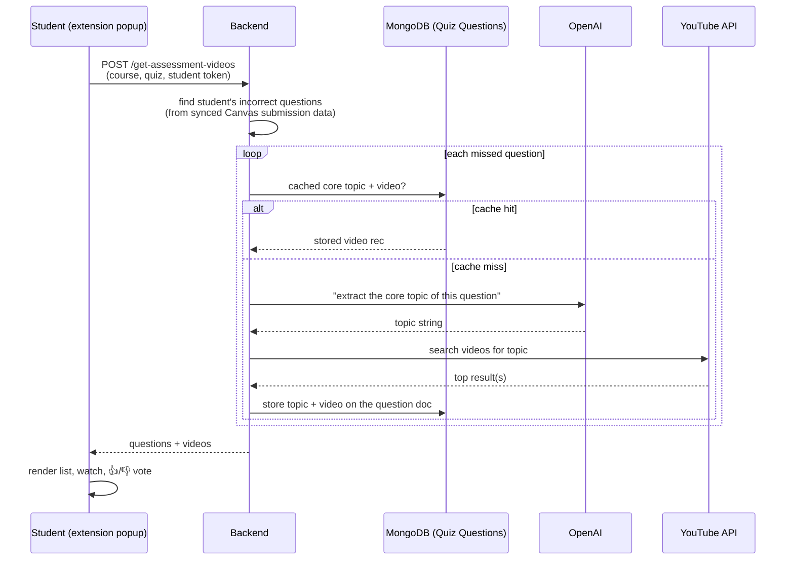

# Flow: Student Video Recommendations (KnowGap's core loop)

A student misses quiz questions in Canvas → the extension shows them YouTube videos that teach exactly those topics.

## Key points
- **Caching is the design center:** the AI topic and chosen video are stored on the question document in the `Quiz Questions` collection, so the expensive OpenAI+YouTube path runs once per question, ever (until refreshed).
- **Incorrect answers** come from quiz submission data the [[Flow - Background Canvas Sync|sync loop]] already pulled — endpoint `/get-incorrect-questions`.
- **Instructor curation:** instructors can override the video for any question from `InstructorView.jsx` → `POST /add-video`.
- **Votes:** students rate videos (`/get-video-votes` + a vote-update path) — intended to improve recommendations later.
- **Support videos** are a parallel, simpler flow: `POST /get-support-video` returns mental-health/wellness videos chosen by the student's **risk level** ([[Flow - Risk Prediction]]) — `support_service.py`.

## Files to read for this flow
Extension: `Studentview.jsx` (fetch + render), `InstructorView.jsx` (curation)
Backend: `video_routes.py` → `video_service.py` → `utils/ai_utils.py` + `utils/youtube_utils.py`; `support_routes.py` → `support_service.py`
